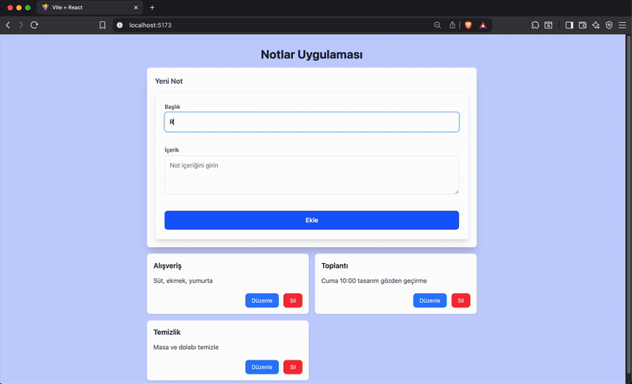

# Note Task

> A modern and fast React app where you can easily add and edit your personal notes.

## Preview

---

## 🚀 Features

- Adding, deleting, and editing notes
- Notes are permanently stored in local storage
- Modern and responsive interface (Tailwind CSS)
- Fast and easy to use
- Form validation and error messages

## 🛠️ Technologies & Libraries Used

- [React](https://react.dev/) (SPA architecture)
- [Vite](https://vitejs.dev/) (rapid development environment)
- [Tailwind CSS](https://tailwindcss.com/) (modern styling)
- [Zustand](https://zustand-demo.pmnd.rs/) (global state management)
- [React Hook Form](https://react-hook-form.com/) (form management and validation)
- [React Router DOM](https://reactrouter.com/) (page redirect)
